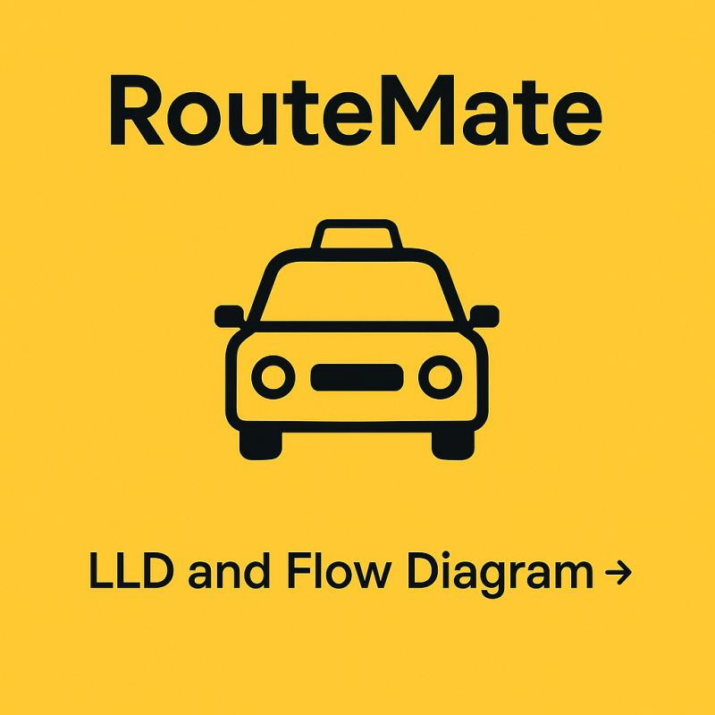
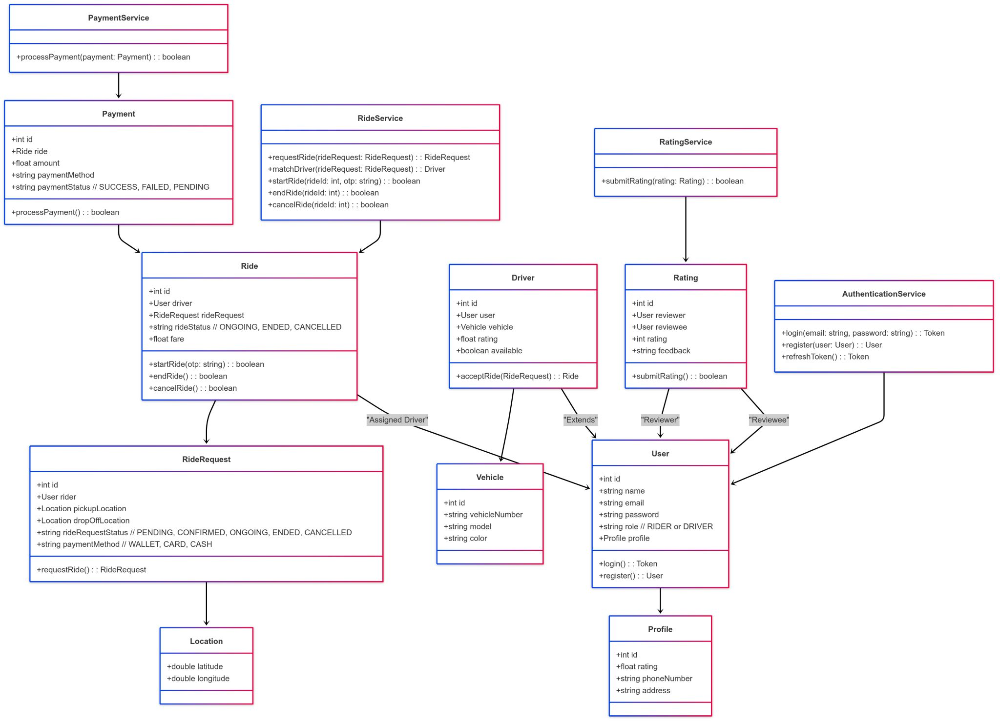
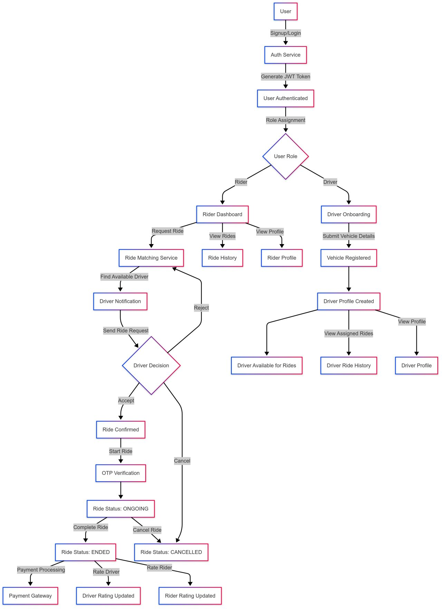
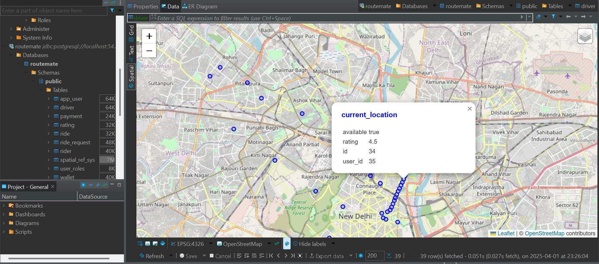
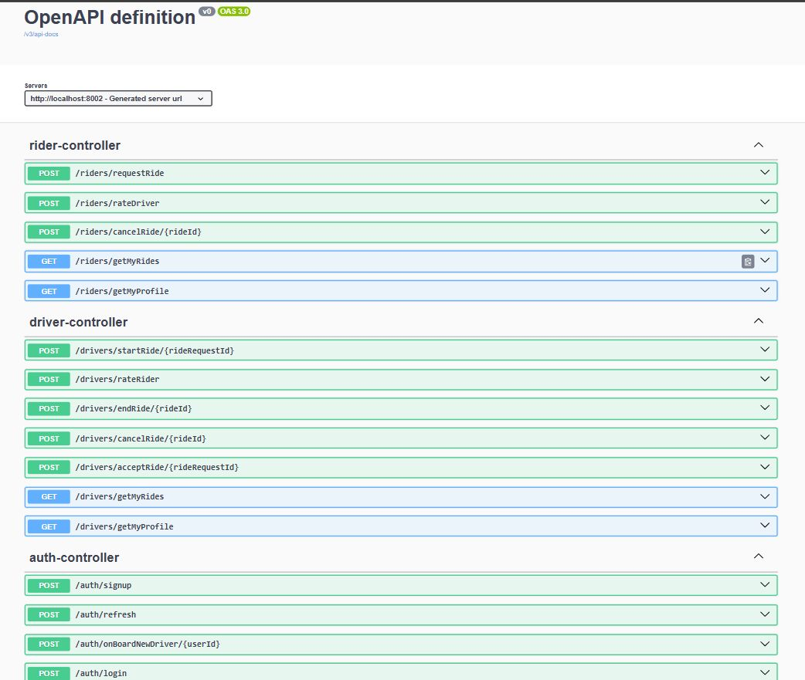

**# RouteMate

🚗💨 Introducing RouteMate: A Ride-Sharing Application! 🚀
I designed and developed the backend architecture for a scalable and efficient ride-sharing platform, ensuring a seamless user experience, security, and real-time ride tracking. The system supports dynamic pricing, secure payments, and optimized driver-matching algorithms, redefining modern mobility.

🔹 **Key Features**
- ✅ Real-time Location Tracking with PostGIS 📍
- ✅ Optimized Driver-Matching Algorithms for quick ride allocation 🚖
- ✅ Dynamic Pricing & Surge Management based on demand 📈
- ✅ Secure & Flexible Payments (wallet support for drivers & riders) 💳
- ✅ Concurrency Control to prevent multiple drivers from accepting the same ride 🔄
- ✅ Email Notifications for seamless coordination 📲
- ✅ Driver & Rider Ratings to ensure top-quality service ⭐
- ✅ Ride History Logs for user convenience 📝
- ✅ Scalable & Future-Ready, allowing seamless feature expansion 🔥

💡 **Challenges Overcome**
- 🔹 Transaction Locking & Concurrency Control to prevent duplicate ride acceptance ❌
- 🔹 Role-Based Authentication & Access Control (RBAC) for enhanced security 🔒

🖥️ **Tech Stack**
- 🔹 Backend: Java, Spring Boot, Spring Data JPA, Hibernate, RESTful APIs
- 🔹 Security: JWT Authentication, Role-Based Access Control (RBAC)
- 🔹 Database & Location Services: PostgreSQL, PostGIS (Geospatial Tracking)
- 🔹 Tools: Postman, Swagger API UI
- 🔹 Communication Protocol: SMTP

